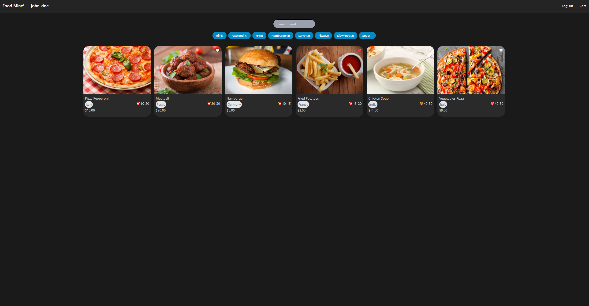
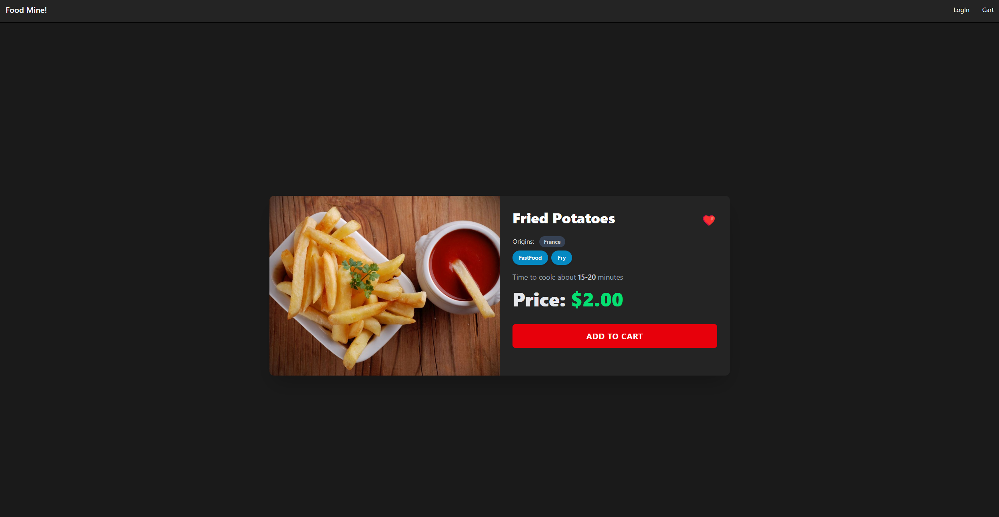
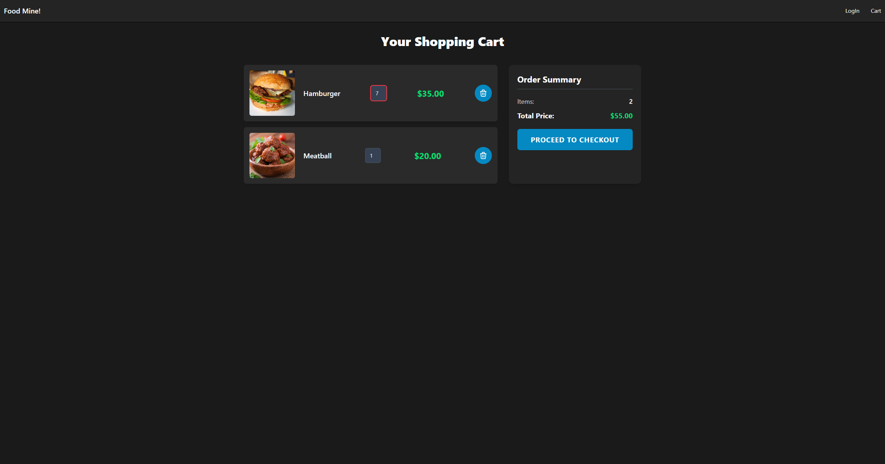
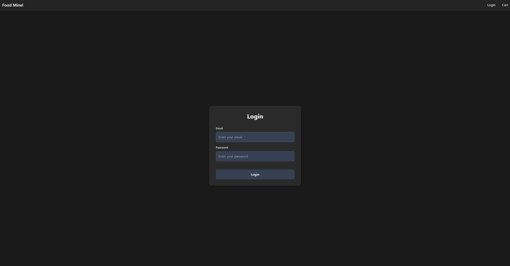

# **Online Restaurant Application**

This project consists of an Angular frontend and a PHP backend, designed to simulate an online food ordering system. Users can browse food items, search by name or tags, view details, manage a shopping cart, and interact with a backend API for data.

## **Table of Contents**

1. [Project Overview](#bookmark=id.7vgj1r50qqj2)
2. [Features](#bookmark=id.uiul0iqf0otp)
3. [Technologies Used](#bookmark=id.74lv3bdnir7d)
4. [Screenshots](#bookmark=id.lkgnubvh2u1b)
5. [API Endpoints](#bookmark=id.550x2vhy9h7l)
6. [Database Schema](#bookmark=id.zatwd57mj8mv)
7. [Contributing](#bookmark=id.15mmbdjjtbx9)

## **1\. Project Overview**

The "Online Restaurant" application provides a user-friendly interface for Browse and ordering food. The Angular frontend consumes data from a custom-built PHP API backend. Key functionalities include:

- Displaying a list of food items.
- Filtering food items by tags.
- Searching food items by name.
- Viewing detailed information for each food item.
- A login page for user authentication (placeholder for now).
- A shopping cart functionality.
- User favorites (backend support).

## **2\. Features**

- **Food Catalog:** Browse a variety of food items with images, names, prices, cook times, and origins.
- **Tag-Based Filtering:** Filter food items by categories like 'FastFood', 'Pizza', 'Lunch', etc.
- **Search Functionality:** Quickly find food items by typing in a search term.
- **Food Details:** View detailed information for each food item.
- **Shopping Cart:** Add items to a cart, adjust quantities, and view order summary.
- **User Authentication (Planned):** Login page with dark theme integration.
- **User Favorites (Backend Ready):** Functionality to mark food items as favorites.

## **3\. Technologies Used**

**Frontend:**

- **Angular:** A platform and framework for building single-page client applications.
- **TypeScript:** A superset of JavaScript that adds static typing.
- **Tailwind CSS:** A utility-first CSS framework for rapid UI development.

**Backend:**

- **PHP:** Server-side scripting language for API logic.
- **PDO (PHP Data Objects):** For secure database interaction.
- **Apache (via XAMPP):** Web server for serving PHP files and handling URL rewriting.
- **MySQL:** Relational database for storing application data.

## **4\. Screenshots**

Here are some screenshots showcasing the application's interface:

### **Main Food Catalog**

###

###

###

###

###

### **Food Detail View**

### **Shopping Cart**

###

###

###

###

### **Login Page**

###

## **5\. API Endpoints**

The PHP backend exposes the following API endpoints:

- **GET /OnlineRestaurant/foods**: Retrieves a list of all food items.
- **GET /OnlineRestaurant/foods/{id}**: Retrieves a single food item by its ID.
- **GET /OnlineRestaurant/foods?searchTerm={term}**: Searches for food items by name.
- **GET /OnlineRestaurant/foods?tag={tag_name}**: Filters food items by a specific tag.

## **6\. Database Schema**

The database online_restaurant_db contains the following tables:

- **foods**: Stores information about each food item.
  - id (INT, PK, AUTO_INCREMENT)
  - name (VARCHAR)
  - cookTime (VARCHAR)
  - price (DECIMAL)
  - favorite (BOOLEAN)
  - origins (VARCHAR)
  - stars (DECIMAL)
  - imageUrl (VARCHAR)
- **tags**: Stores unique tag names.
  - id (INT, PK, AUTO_INCREMENT)
  - tag_name (VARCHAR, UNIQUE)
- **food_tags**: A pivot table linking foods to tags.
  - food_id (INT, FK)
  - tag_name (VARCHAR, FK)
- **users**: Stores user registration information.
  - id (INT, PK, AUTO_INCREMENT)
  - username (VARCHAR, UNIQUE)
  - email (VARCHAR, UNIQUE)
  - password_hash (VARCHAR) \- **Stores hashed passwords.**
  - created_at (TIMESTAMP)
- **users_favorites**: Links users to their favorited food items.
  - user_id (INT, FK)
  - food_id (INT, FK)
  - favorited_at (TIMESTAMP)

## **7\. Contributing**

Feel free to fork this repository and contribute\!
