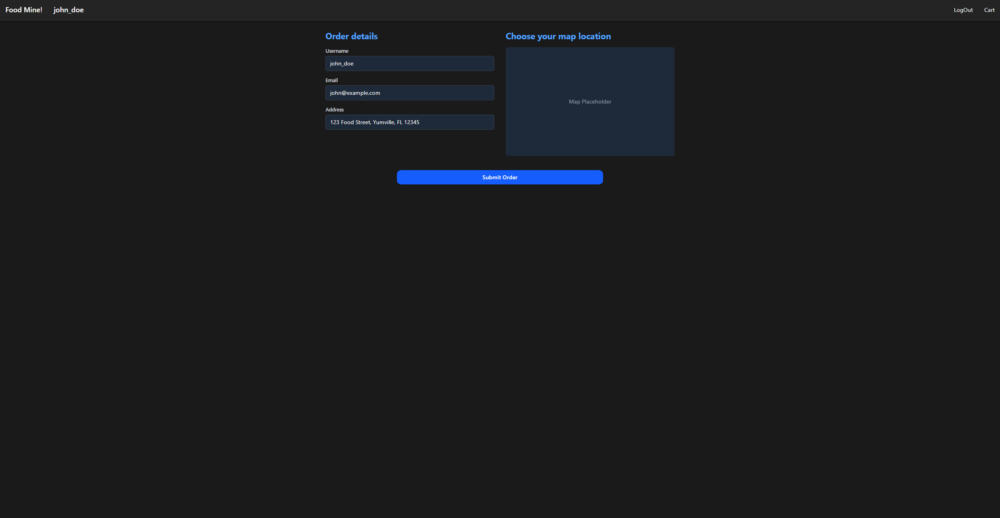

# **Online Restaurant Application**

This project consists of an Angular frontend and a PHP backend, designed to simulate an online food ordering system. Users can browse food items, search by name or tags, view details, manage a shopping cart, place orders, and interact with a robust backend API for data management.

## **Table of Contents**

1. [Project Overview](#project-overview)
2. [Features](#features)
3. [Technologies Used](#technologies-used)
4. [Screenshots](#screenshots)
5. [API Endpoints](#api-endpoints)
6. [Database Schema](#database-schema)
7. [Contributing](#contributing)

## **1. Project Overview**

The "Online Restaurant" application provides a user-friendly interface for browsing and ordering food. The Angular frontend consumes data from a custom-built PHP API backend. Key functionalities include:

- Displaying a comprehensive list of food items.
- Filtering food items by tags and searching by name.
- Viewing detailed information for each food item.
- Robust user authentication and session management.
- A fully functional shopping cart and checkout process.
- User favorites management.
- Order placement and confirmation.

## **2. Features**

- **Food Catalog:** Browse a variety of food items with images, names, prices, cook times, and origins.
- **Tag-Based Filtering:** Filter food items by categories like 'FastFood', 'Pizza', 'Lunch', etc., with dynamic counts.
- **Search Functionality:** Quickly find food items by typing in a search term.
- **Food Details:** View detailed information for each food item.
- **Shopping Cart:** Add items to a cart, adjust quantities, remove items, and view order summary.
- **User Authentication:** Secure login and logout functionality with JWT-based authentication.
- **User Favorites:** Users can mark food items as favorites, with their status persisted on the backend.
- **Checkout Process:** A dedicated page for users to review their order details and provide customer information (username, email, address).
- **Order Placement:** Submit the cart as a new order, saving details and individual items to the database.
- **Order Confirmation:** Display details of the newly placed order to the user.

## **3. Technologies Used**

**Frontend:**

- **Angular:** A platform and framework for building single-page client applications.
- **TypeScript:** A superset of JavaScript that adds static typing.
- **Tailwind CSS:** A utility-first CSS framework for rapid UI development.
- **RxJS:** For reactive programming with Observables.
- **Angular Reactive Forms:** For robust form handling and validation.
- **Angular Router:** For client-side navigation and route guards.

**Backend:**

- **PHP:** Server-side scripting language for API logic.
- **PDO (PHP Data Objects):** For secure database interaction and prepared statements.
- **Apache (via XAMPP):** Web server for serving PHP files and handling URL rewriting.
- **MySQL:** Relational database for storing application data.
- **Firebase JWT:** For handling JSON Web Token generation and validation.
- **PHP Dotenv:** For managing environment variables (`.env` file) during local development.

**Deployment:**

- **Firebase Hosting:** For deploying the Angular frontend.

## **4. Screenshots**

Here are some screenshots showcasing the application's interface:

### **Main Food Catalog**

### **Food Detail View**

### **Shopping Cart**

### **Login Page**

### **Checkout Page**

## **5. API Endpoints**

The PHP backend exposes the following API endpoints:

- **Authentication & User Management:**

  - `POST /OnlineRestaurant/login`: Authenticates a user and returns JWT tokens.
  - `POST /OnlineRestaurant/logout`: Invalidates a user's refresh token.

- **Food & Tag Retrieval:**

  - `GET /OnlineRestaurant/foods`: Retrieves a list of all food items.
  - `GET /OnlineRestaurant/foods/{id}`: Retrieves a single food item by its ID.
  - `GET /OnlineRestaurant/foods?searchTerm={term}`: Searches for food items by name.
  - `GET /OnlineRestaurant/foods?tag={tag_name}`: Filters food items by a specific tag.
  - `GET /OnlineRestaurant/tags`: Retrieves a list of all unique tags with their associated food counts (e.g., FastFood (4), Pizza (2)).

- **Favorites Management (Requires Authentication):**

  - `POST /OnlineRestaurant/favorites/{foodId}`: Adds a food item to the authenticated user's favorites.
  - `DELETE /OnlineRestaurant/favorites/{foodId}`: Removes a food item from the authenticated user's favorites.

- **Order Management (Requires Authentication):**
  - `POST /OnlineRestaurant/orders`: Places a new order, saving cart items.
  - `GET /OnlineRestaurant/orders`: (Planned) Retrieves a list of all orders for the authenticated user.

## **6. Database Schema**

The database `online_restaurant_db` contains the following tables:

- **foods**: Stores information about each food item.
  - `id` (INT, PK, AUTO_INCREMENT)
  - `name` (VARCHAR)
  - `cook_time` (VARCHAR)
  - `price` (DECIMAL)
  - `origins` (VARCHAR)
  - `stars` (DECIMAL)
  - `image_url` (VARCHAR)
- **tags**: Stores unique tag names.
  - `id` (INT, PK, AUTO_INCREMENT)
  - `name` (VARCHAR, UNIQUE)
- **food_tags**: A pivot table linking foods to tags.
  - `food_id` (INT, FK -> foods.id)
  - `tag_name` (VARCHAR, FK -> tags.name)
- **users**: Stores user registration information.
  - `id` (INT, PK, AUTO_INCREMENT)
  - `username` (VARCHAR, UNIQUE)
  - `email` (VARCHAR, UNIQUE)
  - `password_hash` (VARCHAR) - **Stores hashed passwords.**
  - `address` (VARCHAR)
  - `created_at` (TIMESTAMP)
- **user_favorites**: Links users to their favorited food items.
  - `user_id` (INT, FK -> users.id)
  - `food_id` (INT, FK -> foods.id)
  - `favorited_at` (TIMESTAMP)
- **orders**: Stores main order details.
  - `id` (INT, PK, AUTO_INCREMENT)
  - `user_id` (INT, FK -> users.id)
  - `total_price` (DECIMAL)
  - `customer_name` (VARCHAR)
  - `customer_email` (VARCHAR)
  - `customer_address` (VARCHAR)
  - `payment_id` (VARCHAR, NULLABLE)
  - `status` (VARCHAR) - e.g., 'Pending', 'Processing', 'Delivered'
  - `created_at` (TIMESTAMP)
  - `updated_at` (TIMESTAMP)
- **refresh_tokens**: Stores hashed refresh tokens for session management.
  - `user_id` (INT, FK -> users.id)
  - `token_hash` (VARCHAR)
  - `expires_at` (TIMESTAMP)

## **7. Contributing**

Feel free to fork this repository and contribute!
